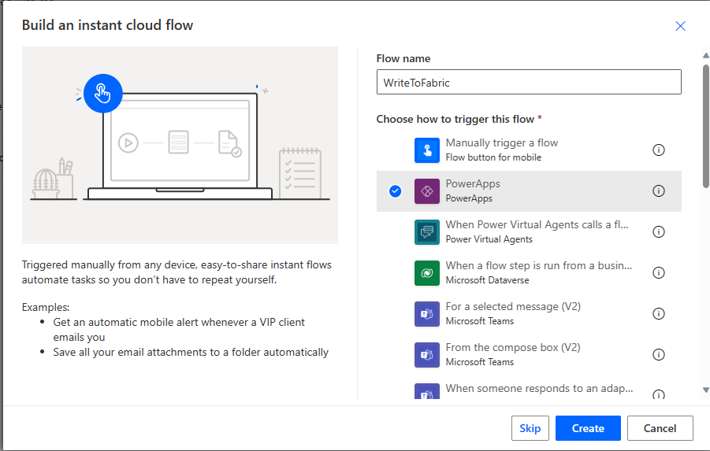
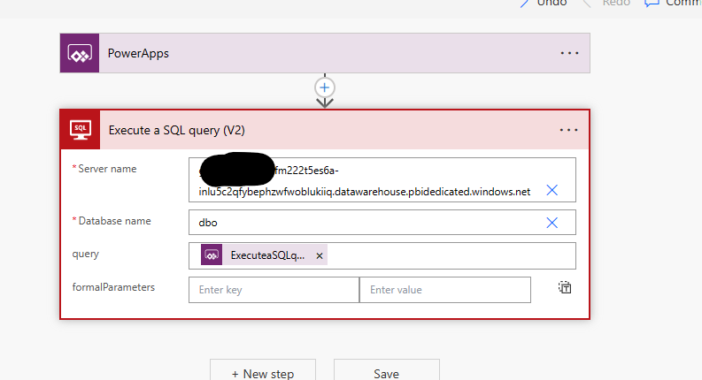
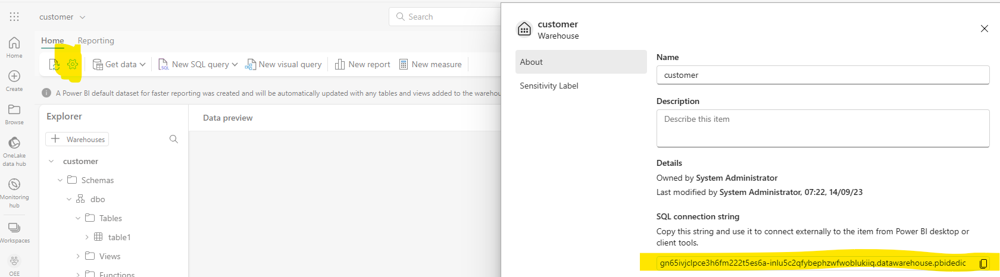
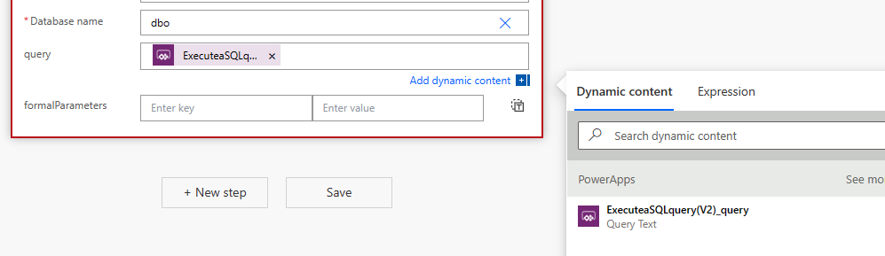
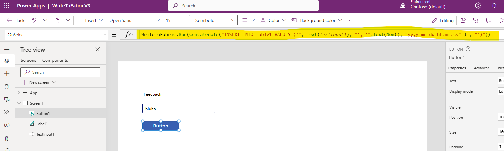
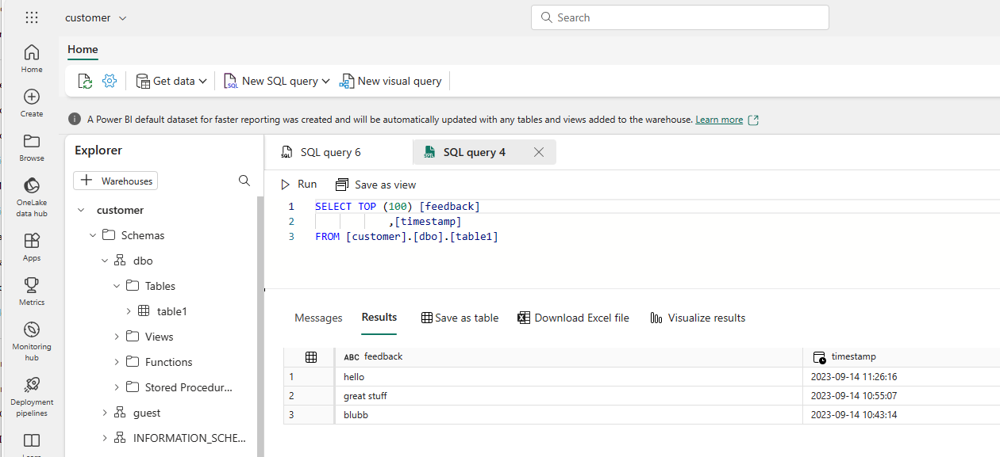
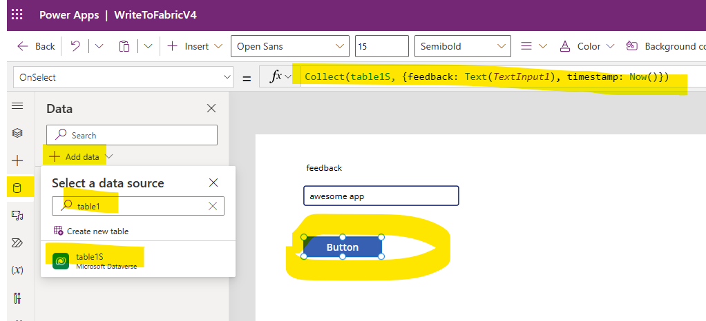
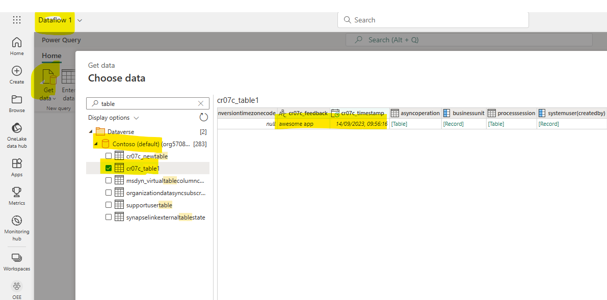
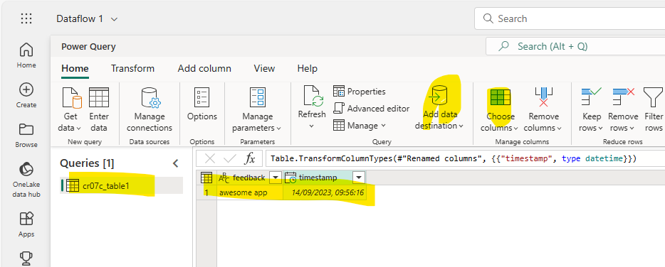

# Write data from Power Apps to Fabric

You may have encountered use cases where it would be quite useful to have a direct path from your Power App which is end user- or frontline worker- facing to an analytics backend and the reports which are built on top of that analytics backend.\
Another use case would be, if you build meta-data driven ETL pipelines, store the metadata in Fabric and want to edit this meta data via a Power App.\
This article is about writing data from a Power App to Microsoft Fabric.
\
\
While we are waiting on the [Synapse Link from Dataverse to Fabric](https://learn.microsoft.com/en-us/power-platform/release-plan/2023wave1/data-platform/synapse-link-dataverse-enables-direct-integration-fabric-power-bi) which will be a very convenient way to replicate data from Dataverse to a Fabric Lakehouse, I want to show you two ways which are working already and one of them doesn´t even need to write data to Dataverse first.\
\
Here are the two approaches I want to show you:

1. Using a Power Automate Flow
2. Writing to Dataverse first, then using a Dataflow Gen 2 to transfer data from Dataverse to Fabric

The first one is leveraging the compatibility of the Fabric Warehouse to MS-SQL Connectors and allow you to directly write to a Warehouse in realtime. The second one is using a similar mechanism as the Synapse Link from Dataverse to Fabric and replicates the data from Dataverse to Fabric in a batch process.

## Step 0: Create a warehouse and a target table

First of all you need a Warehouse in Fabric. If you haven´t created one, check out this tutorial: https://learn.microsoft.com/en-us/fabric/data-warehouse/create-warehouse

Next you want to create a table, which will be your target you want to write to:
https://learn.microsoft.com/en-us/fabric/data-warehouse/create-table

Now that you are all set up, let´s check out the two approaches.

### Approach 1: Using a Power Automate Flow

Let´s open the Power Apps maker in a separate tab. 
Go to the Flows-section and create a new blank instant cloud flow and choose PowerApps as the trigger.



Create a new step of the type "Execute a SQL query (V2)" on a SQL Server.



To get the "SQL Server name", switch to the Fabric Warehouse and click on the gear-symbol to see its settings.
There you can find the "connection string". Copy this value and use it as "SQL server name".



For "SQL database name" use "dbo".
For the query use the dynamic content from the Power Apps



Let´s create a new blank canvas Power App. Create Text input fields and a button.
Configure the button, so that "OnSelect" it runs the previously defined Flow with an INSERT-Statement.
In my example, the name of the table in the warehouse is "table1" and it has the fields "feedback" and "timestamp".
My "OnSelect"-Configuration looks like this:



```
WriteToFabric.Run(Concatenate("INSERT INTO table1 VALUES ('", Text(TextInput1), "', '",Text(Now(), "yyyy-mm-dd hh:mm:ss" ) , "')"))
```

Whenever you click the button, a new record is inserted in the table using the text in the TextInput for the "feedback" field and the current timestamp for "timestamp".

To verify you can check the Fabric Warehouse. If it doesn´t work you might want to look at the Flow monitoring to debug your SQL-Statement.



### Approach 2: Writing to Dataverse first, then using a Dataflow Gen 2 to transfer data from Dataverse to Fabric

This approach is using a data connection to a table in Dataverse.
Therefore create a new table in the tables section in Power Apps.
Create a new blank canvas Power App and build a connection to this newly created table.
Then build an app similar as in approach 1, however the "OnSelect"-Configuration looks different. 
Here you want to use something like:

```
Collect(table1S, {feedback: Text(TextInput1), timestamp: Now()})
```

You can see all important items here:



Now the data is inserted from the Power App to the Dataverse table.
To replicate the data to Fabric you want to switch to the Fabric experience.\

[Create a Dataflow Gen 2](https://learn.microsoft.com/en-us/fabric/data-factory/create-first-dataflow-gen2)
\
Click on the "Get Data"-button and select Dataverse as the data source.\
Set your configurations (Note that the environment details are optional).\
In the "Choose Data"-Screen navigate to your previously created table and select it. Note that the table will have some prefix like cr07c_ and there will be additional metadata columns and not only the ones you defined.\
You should see a preview of the data. Then click on "Create".



On the next screen you see the PowerQuery-Interface where you can do No-Code/Low-Code-Transformations.
Here we can filter the columns to only derive the ones we want and rename them to get rid of the prefix.
Next we want to set a data destination.



Select "Warehouse" and navigate to the Warehouse and table you want to write to.
Once set up, publish and refresh the Dataflow.
Now the Data gets written to the Warehouse in a batch process.

To keep the data in sync you need to schedule and regularly rerun the Dataflow.
Also note that without further logic this will insert all the data from the Dataverse table to the Warehouse. So you either have to define a logic to filter on only new data or do a full replacement every time you run the dataflow.

## Summary

To sum it up these are two approaches how to transfer data from your Power Apps to Fabric for Data Analytics purposes.
The first approach using Flows is lightweight and transfers the data in real-time. To avoid hacking INSERT statements into the Power App, this could be improved by using stored procedures on the Warehouse side and calling them from the Flow.
The second approach is pretty straightforward and allows for a lot of flexibility when it comes to doing data transformations on the way. But it only transfers the data in a batch process, making the whole transfer slower and heavy-weight.
Choose wisely which approach fits best to your use case.

Thank you for reading, leave your comments and let me know your questions and feedback.

**NOTE:** Don´t take this article as official documentation but rather as a source of inspiration.